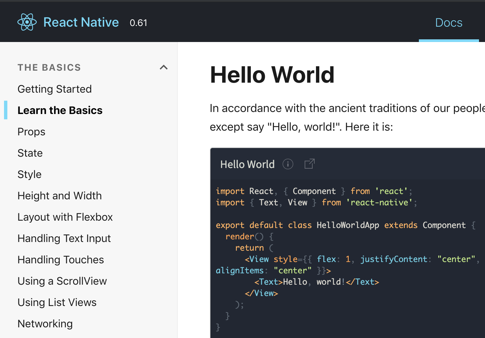
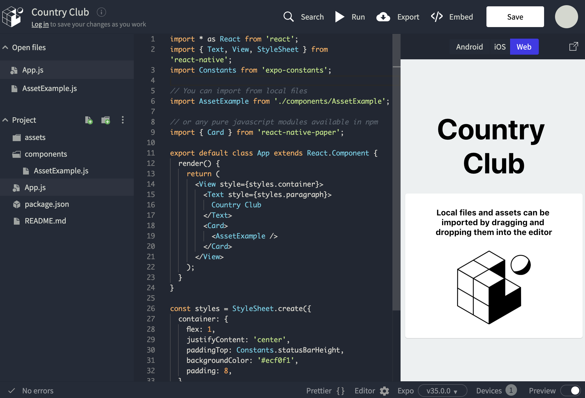

This year, the team has been discussing building an app as for their solution!
To help get going on this path, here are some links to start using and learning about coding an app.
We will add more helpful links as we find them.

This might be very confusing before learning the basics first.

Javascript is the language that is used when writing an app using React Native.
Javascript handles the basic syntax of the code.
This includes defining and using variables, defining and calling functions, importing and exporting modules, and many other low-level details.

React is the basic framework for putting together the various layers of the app as they are contained in components.
React allows for the use of JSX within code to define the structure of the component.
A component can include components defined by React Native (ScrollView, Text, Image, ...).
A component can also import and include components created by you! 

React Native contains the pieces that convert your Javascript code into a native App.

---

[React Tutorial](https://facebook.github.io/react-native/docs/tutorial)
This is the React Native tutorial put together by Facebook.
The tutorial will walk through some basics of passing props, styling, 

---

[Expo Snack](https://snack.expo.io)
This is an online IDE (Integrated Development Environment) for create an app using React Native.
If you have gone through the above React Tutorial, this is the bigger version of the examples you have already seen.
The IDE has a preview of the code you are working on.
You can also view the app at the same time on a device by clicking on the 'Run' button.
